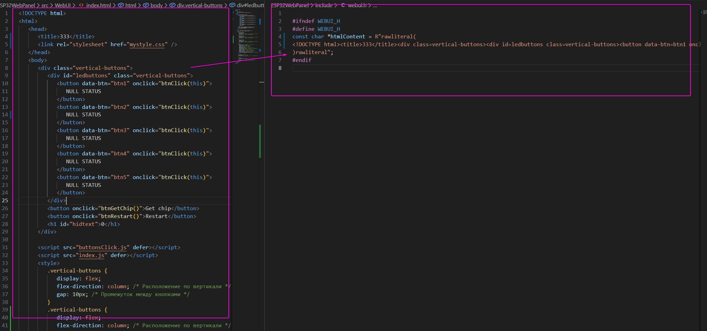

## HtmlMinifier

**HtmlMinifier** — это инструмент для минимизации HTML-кода, который уменьшает его размер, удаляя ненужные пробелы, комментарии и другие избыточные элементы.
Проект написан для платформы ESP32 и ему подобных.

```
https://www.espressif.com/en/products/socs/esp32
```

## Modules

**NUglifyConvertCppHeader** служит узкоспециализированным инструментом для преобразования HTML-строк в заголовки C++

**NUglifyExtractorCssStyle** реализует интерфейс INUglifyProcess и отвечает за извлечение и обработку CSS-стилей из HTML-контента. Его основное назначение — объединение стилей из **style** и **link** тегов в единую секцию.

**NUglifyExtractorJavaScript** реализует интерфейс INUglifyProcess и предназначен для извлечения и обработки JavaScript-кода из HTML-контента. Его основная задача — объединение JavaScript-скриптов из тегов **script** и минимизация их содержимого.

## Custom modules

```cs
public interface INUglifyProcess
{
    public string Call(string content);

    public void AddBaseDirectory(string directory);
}


public class NUglifyTest : INUglifyProcess
{
    public string Call(string content)
    {
        throw new NotImplementedException();
    }

    public void AddBaseDirectory(string directory)
    {
        throw new NotImplementedException();
    }
}
```

## using

```cs
using HtmlMinifier;
using HtmlMinifier.NUglifys;

using (HtmlProcessor processor = new HtmlProcessor())
{
    if (processor.Loaded()) // Loaded(string pathJsonFile = "Options.json")
    {
        Console.WriteLine("Loaded HtmlMinifier...");
        processor.AddInUglify(new NUglifyHtml());
        processor.AddInUglify(new NUglifyExtractorJavaScript());
        processor.AddInUglify(new NUglifyExtractorCssStyle());
        processor.AddInUglify(new NUglifyConvertCppHeader());
        processor.Build();
        processor.StartTask();
    }
    else
    {
        Console.WriteLine("Error Loading HtmlMinifier...");
    }
}
```

## Config

**Options.json**

```json
{
   "PathHtmlFile": "C:\\Users\\Igla\\Documents\\PlatformIO\\Projects\\ESP32WebPanel\\src\\WebUI\\index.html",
   "PathOutputHtmlFile": "C:\\Users\\Igla\\Documents\\PlatformIO\\Projects\\ESP32WebPanel\\include\\webui.h",
   "Content": "Options.html"
}
```
